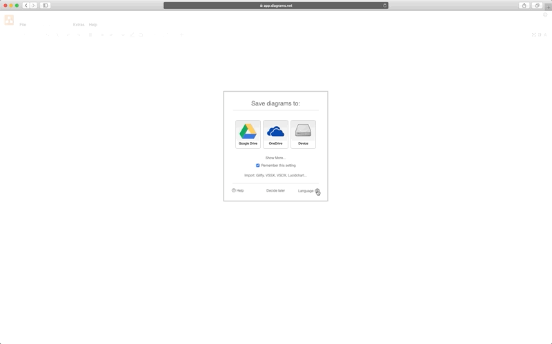

# C4 Draw.io 模板
C4 是一个很好的架构记录和阐述模式  
这个模板，提供了在  [Draw.io](https://app.diagrams.net/) 上在线妥妥拽拽画 C4 的 元素模板
## 如何使用这个模板
* 请打开 [Draw.io](https://app.diagrams.net/) 网站
* 配置语言，刷新页面后进入到主界面  
  
* 从 URL 加载模板(https://raw.githubusercontent.com/victoryw/c4-drawio-template/master/c4-demo.drawio)
  
* 开始工作
* 保存工作到本地文件  
  
* 导入本地工作文件以继续
  
* 导出为图片
  